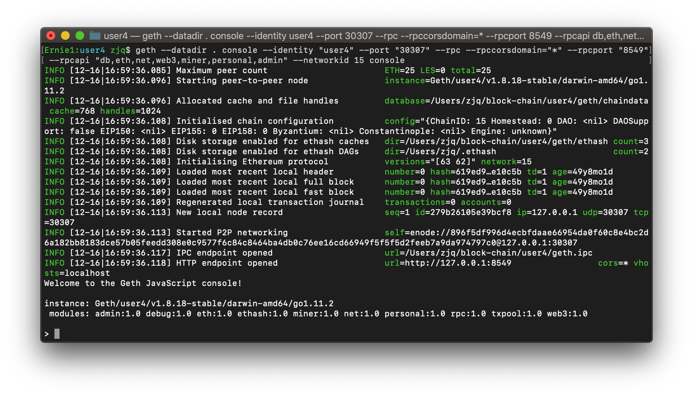

<h1 align="center">曝光台</h1>

基于 Web3 和 Vue.JS 的 dAPP

## 背景
    区块链是基于P2P网络、共识机制和加密算法等技术的新型应用模式，有广阔的应用前景。该曝光台基于区块链，利用区块链去中心化、数据难以篡改的特点，提供更优越的业务功能。
### 优势
- 管理高效性  
    
    智能合约的灵活运用提高管理效率，曝光台的透明性、实时性有助于使用者的自动化、精细化管理，有效降低了人力成本，保证了沟通质量的稳定性。
- 系统安全性  
    
    - 在内容层面，区块链上的数据无法被篡改；
    - 在结构层面，区块链数据的分布式存储使得少量节点的故障难以影响整个区块链的安全；
    - 在访问层面，区块链技术的加密机制将没有相关密钥的节点拒之门外，降低了非法访问的可能性。
## 系统总体架构
- 智能合约

    使用 solidity 语言，负责管理用户信息和曝光信息、控制数据操作权限，系统节点包含、数据管理服务。
- 以太坊客户端

    使用 go-ethereum 客户端，将系统节点连接到以太坊网络，从而调用合约函数发送交易（注册用户、创建曝光、回复曝光）。以太坊客户端会对用户提供的以太坊账户地址、密钥对进行检查实现身份认证。之后，用户从系统节点发出的所有交易都由该账户发起，并由该账户提供发起交易所需的以太币。
- 用户界面

    使用 Web3 实现用户界面和以太坊客户端的交互，使用 Vue.JS 搭建直观友好的操作界面，降低用户学习成本。
## 使用说明

[client/config/index.js](client/config/index.js)
## 测试