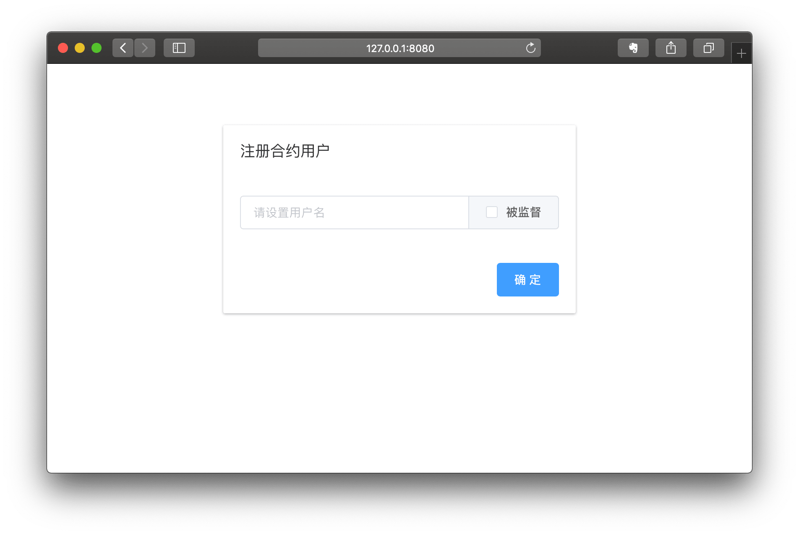
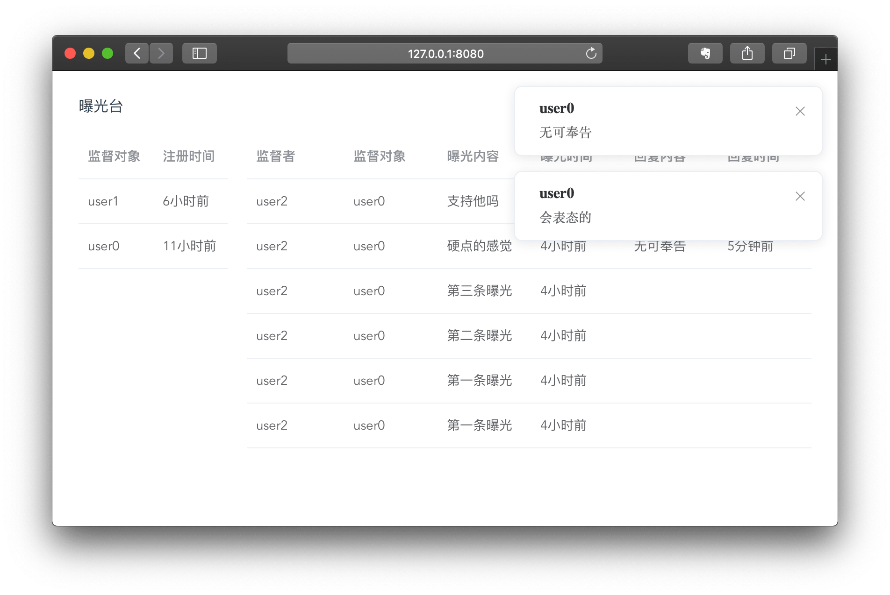

<h1 align="center">曝光台</h1>
<p align="center">
基于 Web3 和 Vue.JS 的 dAPP
</p>

## 背景
区块链是基于 P2P 网络、共识机制和加密算法等技术的新型应用模式，有广阔的应用前景。该曝光台基于区块链，利用区块链去中心化、数据难以篡改的特点，提供更优越的业务功能。
### 优势
- 管理高效性  
    
    智能合约的灵活运用提高管理效率，曝光台的透明性、实时性有助于使用者的自动化、精细化管理，有效降低了人力成本，保证了沟通质量的稳定性。
- 系统安全性  
    
    - 在内容层面，区块链上的数据无法被篡改；
    - 在结构层面，区块链数据的分布式存储使得少量节点的故障难以影响整个区块链的安全；
    - 在访问层面，区块链技术的加密机制将没有相关密钥的节点拒之门外，降低了非法访问的可能性。
## 总体架构
- [智能合约](ET.sol)

    使用 solidity 语言，负责管理用户信息和曝光信息、控制数据操作权限，系统节点包含、数据管理服务。
- 以太坊客户端

    使用 go-ethereum 客户端，将系统节点连接到以太坊网络，从而调用合约函数发送交易（注册用户、创建曝光、回复曝光）。以太坊客户端会对用户提供的以太坊账户地址、密钥对进行检查实现身份认证。之后，用户从系统节点发出的所有交易都由该账户发起，并由该账户提供发起交易所需的以太币。
- [用户界面](UI/src/components/ET.vue)

    使用 Web3 实现用户界面和以太坊客户端的交互，使用 Vue.JS 搭建直观友好的操作界面，降低用户学习成本。
## 使用说明
### 前期准备
需要自行[安装 geth](https://github.com/ethereum/go-ethereum/wiki/Installing-Geth)。

然后克隆该仓库。
```bash
~ $ git clone https://github.com/Ernie1/exposure-table.git && cd exposure-table
```
### 启动以太坊客户端
新建多个位于 exposure-table 文件夹位置的终端窗口以启动多个节点。
```bash
exposure-table $ cd user0 && geth --datadir . console --identity "user0" --port "30303" --rpc --rpccorsdomain="*" --rpcport "8545" --rpcapi "db,eth,net,web3,miner,personal,admin" --networkid 15 console
```
```bash
exposure-table $ cd user1 && geth --datadir . console --identity "user1" --port "30304" --rpc --rpccorsdomain="*" --rpcport "8546" --rpcapi "db,eth,net,web3,miner,personal,admin" --networkid 15 console
```
```bash
exposure-table $ cd user2 && geth --datadir . console --identity "user2" --port "30305" --rpc --rpccorsdomain="*" --rpcport "8547" --rpcapi "db,eth,net,web3,miner,personal,admin" --networkid 15 console
```
```bash
exposure-table $ cd user3 && geth --datadir . console --identity "user3" --port "30306" --rpc --rpccorsdomain="*" --rpcport "8548" --rpcapi "db,eth,net,web3,miner,personal,admin" --networkid 15 console
```
如果需要添加更多的节点，每个节点需要在 exposure-table 文件夹下新建一个文件夹，然后初始化。
```bash
新的文件夹 $ geth --datadir . init ../genesis.json
```
并按照 user[0-3] 类似的方法启动节点，并获取节点信息。
```bash
> admin.nodeInfo
```
将返回结果的 `enode` 字段的值加入 [UI/config/index.js](UI/config/index.js) 的 `nodeInfo` 字段的数组中。
### 启动用户界面
```bash
exposure-table $ cd UI
UI $ npm install
UI $ npm start
```
打开浏览器访问 `http://localhost:8080` 。可以同时打开多个界面操作不同的节点。

#### 总体效果

#### 操作流程
输入 rpc 端口号连接到对应的以太坊客户端。

如果当前节点没有以太坊账户，需要设置一个密码新建账户。


如果当前节点没有合约（曝光台）用户，需要设置用户名和是否被监督来注册用户，勾选“被监督”的用户身份为监督对象，否则为监督者。


注册合约用户是一笔以太坊交易，需要以太坊账户的权限，如果权限已经超时，需要输入密码解锁。

正确输入密码后，回到“注册合约用户”对话框，再次点击“确定”，以太坊客户端会开始挖矿。

交易完成（注册成功）后会自动停止挖矿，进入曝光台界面。

已经注册合约用户的节点，下次进入用户界面时只需要输入对应的 rpc 端口号连接到以太坊客户端后就可以直接进入曝光台界面。

监督者用户可以点击左侧监督对象条目创建曝光。被监督者用户点击无效。


创建曝光是一笔以太坊交易，需要以太坊账户的权限，如果权限已经超时，需要输入密码解锁。

正确输入密码后，回到“创建曝光”对话框，再次点击“确定”，以太坊客户端会开始挖矿。

交易完成（创建曝光）后会自动停止挖矿，进入曝光台界面。

对应的曝光对象的用户界面会实时显示横幅通知。


被监督者用户可以点击右侧曝光相应条目回复曝光。回复过的和不属于自己的点击无效。监督者用户点击无效。


回复曝光是一笔以太坊交易，需要以太坊账户的权限，如果权限已经超时，需要输入密码解锁。

正确输入密码后，回到“回复曝光”对话框，再次点击“确定”，以太坊客户端会开始挖矿。交易完成（回复曝光）后会自动停止挖矿，进入曝光台界面。

对应的曝光者的用户界面会实时显示横幅通知。


## 测试
连接以太坊客户端失败提示。

注册合约用户时用户名已存在提示。

解锁节点账户时密码错误提示。
